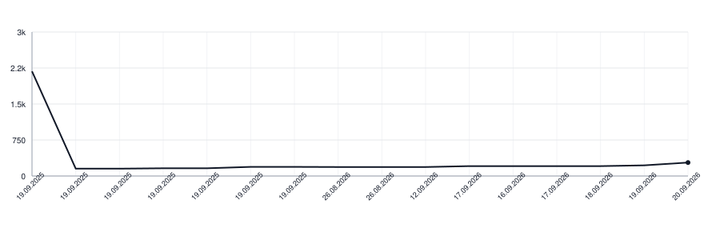

[](https://github.com/botforge-pro/goduration-swift/actions/workflows/test.yml)
[](https://botforge-pro.github.io/goduration-swift/documentation/goduration/)

# goduration-swift

Go-style duration parsing for Swift.

## Installation

```swift
dependencies: [
    .package(url: "https://github.com/botforge-pro/goduration-swift", from: "0.1.1")
]
```

## Usage

```swift
import GoDuration

let oneMinute = try GoDuration.parse("1m")
let twoHours = try GoDuration.parse("2h")
let twoAndAHalfHours = try GoDuration.parse("2h30m")
let negativeEightHours = try GoDuration.parse("-8h")
```

## Documentation

The [Swift-DocC API reference](https://botforge-pro.github.io/goduration-swift/documentation/goduration/)
is generated from the public API on every push to `main`.

## Lines of Code

<picture>
  <source media="(prefers-color-scheme: dark)" srcset=".github/loc-history-dark.svg">
  <source media="(prefers-color-scheme: light)" srcset=".github/loc-history-light.svg">
  
</picture>
